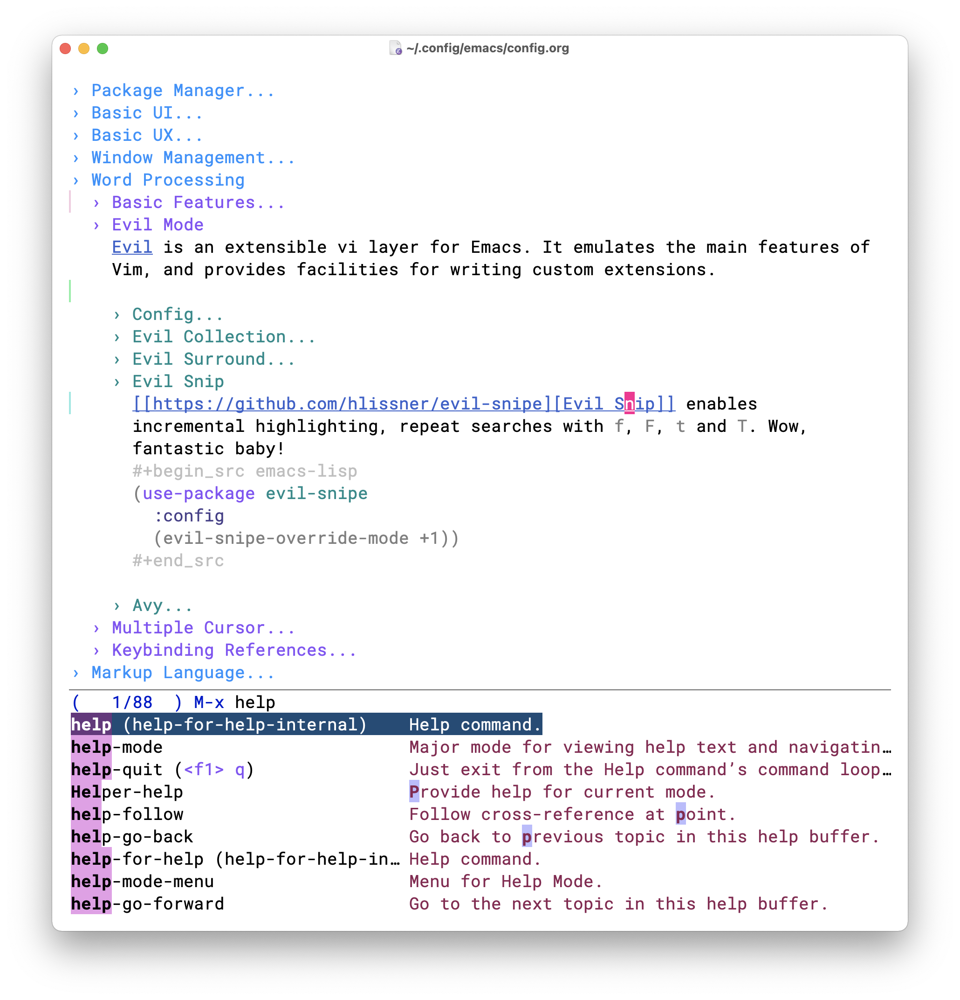

<h1 align="center">
    Ward Emacs
    <br>
    
</h1>

<div align="center">
    <sub>Make <a href="https://www.gnu.org/software/emacs/">Emacs</a> an easy to use Text Editor for English and Chinese on macOS.</sub>
</div>


## Introduction



A minimal Emacs configration that you can start using easily.

| MacOS Preferred Keybindings             | Powerful Features                                      | Suitable Features | Chinese Optimization     |
|-----------------------------------------|--------------------------------------------------------|-------------------|--------------------------|
| [Word Processing](#word-processing)     | [Org Mode](https://orgmode.org/)                       | Markdown          | Improved Display        |
| [Window Management](#window-management) | [Vim Emulator](https://github.com/emacs-evil/evil#readme) | Multiple Cursor   | Search with Pinyin       |
|                                         | [Git Client](https://magit.vc/)                             | Terminal Emulator | Auto switch input method |
|                                         |                                                        |                   | Compatible Keybindings   |


The configuration is in [config.org](config.org).

<details>
<summary>Notes</summary>

- Press <kbd>alt + x</kbd> and type `describe-`, you can findout almost anything in Emacs by yourself.
- Emacs is more highly customizable than you think.
- I mainly support the version that I'm using, most of the code should work on other versions, but I don't have time to care about compatiblity. You can get help from search engine and the great emacs communities ([reddit/emacs](https://www.reddit.com/r/emacs/), [Emacs StackExchange](https://emacs.stackexchange.com/), [emacs-china](https://emacs-china.org/)).
- Do not expect too much, and you'll be happy.
</details>

## Installation
```bash
# Emacs 29
brew tap d12frosted/emacs-plus
brew install emacs-plus@29 --with-dragon-icon --with-native-comp

# Tools
brew install ripgrep

# Font
brew tap willbchang/homebrew-cask-font-roboto-mono
brew install --cask font-roboto-mono-no-svn


# Input Source Switcher
brew tap laishulu/macism
brew install macism
```

```bash
git clone --depth=1 https://github.com/willbchang/ward-emacs.git ~/.config/emacs
```


## Shortcuts
### Word Processing

| Moving Cursor          | Features                          | Convention |
|------------------------|-----------------------------------|------------|
| <kbd>Command + ↑</kbd> | Move to the top of the file.      | MacOS      |
| <kbd>Command + ↓</kbd> | Move to the bottom of the file    | MacOS      |
| <kbd>Command + ←</kbd> | Move to the beginning of the line | MacOS      |
| <kbd>Command + →</kbd> | Move to the end of the line       | MacOS      |
| <kbd>Command + L</kbd> | Go to line                        | MacOS      |
| <kbd>Option + ←</kbd>  | Move to the previous word         | MacOS      |
| <kbd>Option + →</kbd>  | Move to the next word             | MacOS      |

| Selecting Text                 | Features                            | Convention |
|--------------------------------|-------------------------------------|------------|
| <kbd>Command + A</kbd>         | Select all text                     | MacOS      |
| <kbd>Shift + ↑</kbd>           | Select one line up                  | MacOS      |
| <kbd>Shift + ↓</kbd>           | Select one line down                | MacOS      |
| <kbd>Shift + ←</kbd>           | Select one character left           | MacOS      |
| <kbd>Shift + →</kbd>           | Select one character right          | MacOS      |
| <kbd>Shift + Option + ←</kbd>  | Select one word left                | MacOS      |
| <kbd>Shift + Option + →</kbd>  | Select one word right               | MacOS      |
| <kbd>Shift + Command + ↑</kbd> | Select to top of the file          | MacOS      |
| <kbd>Shift + Command + ↓</kbd> | Select to bottom of the file        | MacOS      |
| <kbd>Shift + Command + ←</kbd> | Select to the beginning of the line | MacOS      |
| <kbd>Shift + Command + →</kbd> | Select to the end of the line       | MacOS      |


| Editing Text                        | Features                            | Convention            |
|-------------------------------------|-------------------------------------|-----------------------|
| <kbd>Command + C</kbd>              | Copy selected text                  | MacOS                 |
| <kbd>Command + V</kbd>              | Paste text from clipboard           | MacOS                 |
| <kbd>Command + X</kbd>              | Cut selected text                   | MacOS                 |
| <kbd>Command + Z</kbd>              | Undo text change                    | MacOS                 |
| <kbd>Command + Shift + Z</kbd>      | Redo text change                    | MacOS                 |
| <kbd>Command + F</kbd>              | Search text                         | MacOS                 |
| <kbd>Option  + Delete</kbd>         | Delete a word back                  | MacOS                 |
| <kbd>Command + Delete</kbd>         | Delete to line start                | MacOS                 |
| <kbd>Command + Shift + Delete</kbd> | Delete entire line                  | Personal              |
| <kbd>Command + /</kbd>              | Comment or uncomment line(s)        | MacOS                 |
| <kbd>Shift + Option + ↑</kbd>       | Swap current line and previous line | Emacs (org mode only) |
| <kbd>Shift + Option + ↓</kbd>       | Swap current line and next line     | Emacs (org mode only) |


### Window Management
| Window                         | Features               | Convention |
|--------------------------------|------------------------|------------|
| <kbd>Command + Shift + W</kbd> | Close Current Frame   | macOS      |
| <kbd>Command + Shift + N</kbd>         | Create New Frame      | macOS      |
| <kbd>Command + Q</kbd>         | Quit Emacs             | macOS      |
| <kbd>Command + W</kbd>         | Close Current Buffer   | macOS      |
| <kbd>Command + [</kbd>         | Go to previous Buffer  | macOS      |
| <kbd>Command + ]</kbd>         | Go to next Buffer      | macOS      |
| <kbd>Command + =</kbd>         | Zoom in Buffer         | macOS      |
| <kbd>Command + -</kbd>         | Zoom out Buffer        | macOS      |
| <kbd>Command + 0</kbd>         | Reset Zoom Buffer      | macOS      |
| <kbd>Command + N</kbd>         | Create New Buffer      | macOS      |
| <kbd>Command + S</kbd>         | Save Buffer            | macOS      |
| <kbd>Command + R</kbd>         | Revert Buffer          | macOS      |
| <kbd>Command + ,</kbd>         | Open Preferences       | macOS      |
| <kbd>Command + `</kbd>         | Move to next Frame    | macOS      |
| <kbd>Alt + `</kbd>             | Move to next Window     | Personal   |
| <kbd>Control + `</kbd>         | Open Terminal Emulator | Personal   |


## Credit

It learns from the Emacs Community.

## LICENSE

[AGPL-3.0](./LICENSE)
